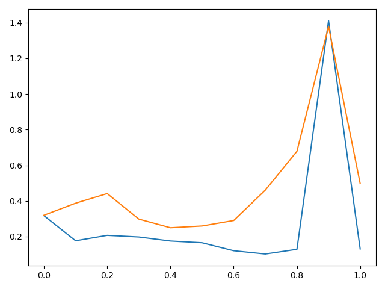

# DNN-DOA

## 原程序运行结果

原程序使用的是tensorflow v1版本，已经将其改造成适用于tensorflow v2版本。

运行结果：[Figure](doc/curve.png)、生成四个文件。

以下是程序生成文件：

[arrayimperf_mc.npy](arrayimperf_mc.npy)

[initial_model_AI.npy](initial_model_AI.npy)

[spatialfilter_model_AI.npy](spatialfilter_model_AI.npy)

[spatialspectrum_model_AI.npy](spatialspectrum_model_AI.npy)

## 分支说明

为了方便整合，现分为三个分支，负责不同任务。分支名和任务如下所示：

- b1：`将阵列改为均匀平面阵 ，对应的角度改为二维`

- b2：`阵列改为任意平面阵列（二维）`

- b3：`阵列改为任意立体阵列（二维）`

请编辑代码时，使用`git checkout` 命令切换到相关分支。如`git checkout b1`即可切换到`b1`分支。代码编辑后请及时push，以供讨论。如果不是很熟悉Git和GitHub的使用方法，可以[上b站上找找相关视频](https://search.bilibili.com/all?keyword=github) ，找个快速入门的就行。

**注意：在对应分支的文件夹下更改代码，不要跨文件夹修改（可能会发生冲突的！）。**

`改进深度学习框架`任务等到以上工作完成后进行。
